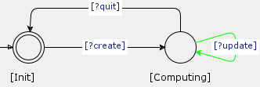

# Contract Automata Runtime Environment Examples and Evaluation

This repository contains examples of usage of the Contract Automata Runtime Environment (<tt>CARE</tt>).

Check the repository of CARE for more info
https://github.com/ContractAutomataProject/CARE

## Alice and Bob

This is a simple example used for evaluating the Contract Automata Runtime Environment (<tt>CARE</tt>).

Two implementations of the example are available for this example, and are located in <tt>src/main/java/io/github/contractautomata/care/examples/alicebob</tt>. 
The  contract automata are under the folder <tt>/resources/alicebob</tt>.

The implementation  <tt>src/main/java/io/github/contractautomata/care/examples/alicebob/example</tt> uses <tt>CARE</tt>. 
Here the main application is located in the file <tt>AppWithCARE.java</tt> whilst the services are under the folder <tt>principals</tt>.

#### Evaluation 

The second implementation of this example <tt>src/main/java/io/github/contractautomata/care/examples/alicebob/exampleWithoutCare</tt> does not use <tt>CARE</tt>. 
In this case all the low-level communications between services and the orchestrator have been implemented from scratch.

These two implementations are compared to show the benefits brought by using <tt>CARE</tt>. 

Using <tt>CARE</tt>, the measures are: 
Lines of Code = 153,
Cyclomatic Complexity = 16,
Cognitive Complexity = 8.

Without using <tt>CARE</tt>, the measures are:
Lines of Code = 784,
Cyclomatic Complexity = 134,
Cognitive Complexity = 166.

This comparison has been performed using SonarCloud, and is available for inspection at:

<a href="https://sonarcloud.io/component_measures?metric=complexity&selected=contractautomataproject_CARE_Example%3Asrc%2Fmain%2Fjava%2Fio%2Fgithub%2Fcontractautomata%2Fcare%2Fexamples%2Falicebob&id=contractautomataproject_CARE_Example">https://sonarcloud.io/component_measures?metric=complexity&selected=contractautomataproject_CARE_Example%3Asrc%2Fmain%2Fjava%2Fio%2Fgithub%2Fcontractautomata%2Fcare%2Fexamples%2Falicebob&id=contractautomataproject_CARE_Example</a>.

#### Video Tutorial

An  earlier video tutorial for importing and executing the Alice and Bob example with CARE, also showing other features of CARE is available at https://youtu.be/Zq0KVUs9FqM.

An executable jar for this example is also available in this page, the next video tutorial below also shows an execution of this example.

## Composition Service

Composition is one of the main operations performed by <tt>CATLib</tt>, and it can be a costly operation.
For a front-end  (e.g., <tt>CATApp</tt>) running on a standard laptop, a desirable feature could be to delegate such costly computations to a remote service, hosted on a powerful machine.

This example showcases a composition service that receives the operands automata together with other options from a client service, and computes the composed automaton. 
The user interacts with the client service at console  to indicate which  automata to compose and the various options. 
<tt>CATLib</tt> features an on-the-fly bounded composition. When extending the bound of a previously computed  composition, the previously generated states of the composition are not recomputed.
The newly generated states are only those that were exceeding the previous bound. Another scalability feature offered by <tt>CATLib</tt> is the possibility of not generating (and visiting) transitions 
of the composition being computed that are violating an invariant property on their labels. For example, in a composition closed under agreement all transitions that are labelled with requests are not generated
(only offers and matches are present).

The sources of this example are located under the folder <tt>src/main/java/io/github/contractautomata/care/examples/compositionService/withCARE</tt> whilst the corresponding 
contract automata are under the folder <tt>resources/compositionService</tt>.

The example is composed of a client contract and a service contract. The client contract is displayed below, whilst the service contract is dual (all requests are turned to offers).

Note that the client contract can perform a necessary request <tt>update</tt> from state <tt>Computing</tt>.
This guarantees that in a non-empty orchestration the necessary request of the client is matched by a corresponding offer.
If such request would not be necessary, a non-empty orchestration could be obtained also when the client is composed with a service
that does not offer the <tt>update</tt> action, but only actions <tt>create</tt> and <tt>quit</tt>.

From state <tt>Init</tt> the client can either terminate or can perform a <tt>create</tt> request. 
The implementation of such request is located in the class ``Client.java``. 
When the request is executed, an object of class ``Payload.java`` is submitted to the remote service. 
For creating the payload object, the client service interacts with the user at console and asks to type the needed input.
The payload contains the automata to compose, a flag indicating whether the composition is closed under agreement, and a bound on the depth of the composed automaton. 
The service receives the offer and replies with the composed automaton. The implementation of the service offers are in the class ``Service.java``.

When performing the <tt>update</tt> request, the client sends an incremented bound to the service, which proceeds to compute the composition with the extended bound and sends it to the client.
The request <tt>quit</tt> is used as a signal for resetting the computed composition and the bound.

The classes <tt>ClientChoiceROC.java</tt> and <tt>ServiceChoiceROC</tt> are extending the class <tt>MajoritarianChoiceRunnableOrchestration.java</tt> of <tt>CARE</tt>. 
In particular, these classes are overriding the method <tt>select</tt> used for selecting one of the possible choice options. 
Indeed, the base implementation performs a probabilistic selection using a uniform distribution and needs to be overridden by each service to implement the specific choices to be made. 
In this example there are two choices: in state <tt>Init</tt> the orchestration can terminate or an action <tt>create</tt> can be executed. 
In state <tt>Computing</tt> two possible actions can be performed. 
The class <tt>ServiceChoiceROC</tt> overrides the method <tt>select</tt> to always reply with an empty answer. 
This means that all choices are external to the service, the service does not indicate which choice has to be made.
The class <tt>ClientChoiceROC</tt> overrides the method <tt>select</tt> and implements both choices as internal. 
The user of the client service will interact at console with the client service, and will indicate which choice has to be made. 

Finally, the executable class <tt>AppComposition.java</tt> is used for testing this example.

#### Video Tutorial

A video tutorial is available at this link https://youtu.be/--FbqHrINek  showing how to run the CompositionService example and the Alice and Bob example. 
The executable jars of both examples have been released in this page.

#### Evaluation

The second implementation of this example is at  <tt>src/main/java/io/github/contractautomata/care/examples/compositionService/withoutCARE</tt> and it does not use <tt>CARE</tt>.
In this case all the low-level communications between services and the orchestrator have been implemented from scratch.

These two implementations are compared to show the benefits brought by using <tt>CARE</tt>.

Using <tt>CARE</tt>, the measures are:
Lines of Code = ...,
Cyclomatic Complexity = ...,
Cognitive Complexity = ....

Without using <tt>CARE</tt>, the measures are:
Lines of Code = ...,
Cyclomatic Complexity = ...,
Cognitive Complexity = ....

This comparison has been performed using SonarCloud, and is available for inspection at:

<a href="https://sonarcloud.io/component_measures?metric=complexity&selected=contractautomataproject_CARE_Example%3Asrc%2Fmain%2Fjava%2Fio%2Fgithub%2Fcontractautomata%2Fcare%2Fexamples%2Falicebob&id=contractautomataproject_CARE_Example">https://sonarcloud.io/component_measures?metric=complexity&selected=contractautomataproject_CARE_Example%3Asrc%2Fmain%2Fjava%2Fio%2Fgithub%2Fcontractautomata%2Fcare%2Fexamples%2Falicebob&id=contractautomataproject_CARE_Example</a>.
